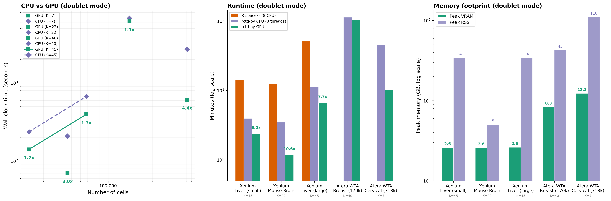

<p align="center">
  <h1 align="center">rctd-py</h1>
  <p align="center">
    <strong>Spatial transcriptomics deconvolution — 6–70x faster than R spacexr, optional GPU acceleration</strong>
  </p>
  <p align="center">
    <a href="https://github.com/p-gueguen/rctd-py/actions/workflows/ci.yml"></a>
    <a href="https://pypi.org/project/rctd-py/"></a>
    <a href="https://pypi.org/project/rctd-py/"></a>
    <a href="https://www.gnu.org/licenses/gpl-3.0"></a>

  </p>
</p>

---

A Python reimplementation of the [spacexr](https://github.com/dmcable/spacexr) RCTD algorithm ([Cable et al., *Nature Biotechnology* 2022](https://doi.org/10.1038/s41587-021-00830-w)) with GPU acceleration via [PyTorch](https://pytorch.org/).

Deconvolve spatial transcriptomics spots (Visium, Xenium, MERFISH, Slide-seq, …) into cell type proportions using a scRNA-seq reference — in minutes instead of hours.

## ✨ Highlights

| | |
|---|---|
| ⚡ **6–70x faster than R on CPU alone** | Xenium 36k cells: **3.5 min** (rctd-py CPU) vs 82 min (R spacexr) |
| 🚀 **Up to 3x more with GPU** | Same dataset: **1.2 min** (rctd-py GPU) — 70x vs R total |
| 🎯 **99.7% concordance** with R spacexr | **100%** with `sigma_override` — per-pixel solver is bit-identical |
| 🔧 **Drop-in replacement** | Same algorithm, same parameters, same results — just faster |
| 📦 **`pip install rctd-py`** | Pure Python, works on CPU out of the box |

## Quick Start

```python
from rctd import Reference, run_rctd
import anndata

# Load data
reference = Reference(anndata.read_h5ad("reference.h5ad"), cell_type_col="cell_type")
spatial = anndata.read_h5ad("spatial.h5ad")

# Run RCTD — handles normalization, sigma estimation, and deconvolution
result = run_rctd(spatial, reference, mode="doublet")
```

📓 **[Tutorial notebook](examples/tutorial.py)** (marimo) · 🌐 **[Rendered tutorial](https://p-gueguen.github.io/rctd-py/)**

## Command Line

After installation, the `rctd` command is available with three subcommands:

```bash
# Check environment, versions, and GPU availability
rctd info
rctd info --json          # machine-readable output

# Validate inputs before a long run (fast, no GPU needed)
rctd validate spatial.h5ad reference.h5ad
rctd validate spatial.h5ad reference.h5ad --json

# Run deconvolution (default: doublet mode)
rctd run spatial.h5ad reference.h5ad
rctd run spatial.h5ad reference.h5ad --mode full
rctd run spatial.h5ad reference.h5ad --mode multi

# Common options
rctd run spatial.h5ad reference.h5ad \
    --mode doublet \
    --output results.h5ad \
    --device cuda \
    --batch-size 5000 \
    --umi-min 20 \
    --cell-type-col cell_type \
    --sigma-override 62

# JSON output for pipelines / AI agents
rctd run spatial.h5ad reference.h5ad --json --quiet
```

<details>
<summary><strong>Output format</strong></summary>

Results are written into a copy of the input spatial h5ad. Default output path is `<spatial_stem>_rctd.h5ad`.

| Slot | Content | Modes |
|------|---------|-------|
| `.obsm["rctd_weights"]` | Cell type weights (N x K) | all |
| `.obs["rctd_dominant_type"]` | Top cell type per pixel | all |
| `.obs["rctd_spot_class"]` | singlet / doublet_certain / doublet_uncertain / reject | doublet |
| `.obs["rctd_first_type"]` | Primary cell type | doublet |
| `.obs["rctd_second_type"]` | Secondary cell type | doublet |
| `.obsm["rctd_weights_doublet"]` | Doublet weights (N x 2) | doublet |
| `.obs["rctd_converged"]` | Convergence flag | full |
| `.obs["rctd_n_types"]` | Number of types per pixel | multi |
| `.obsm["rctd_sub_weights"]` | Per-selected-type weights | multi |
| `.obsm["rctd_cell_type_indices"]` | Selected type indices | multi |
| `.uns["rctd_mode"]` | Mode used | all |
| `.uns["rctd_config"]` | Full config dict | all |
| `.uns["rctd_cell_type_names"]` | Cell type name list | all |

Filtered pixels (below `--umi-min`) have `NaN` weights and `"filtered"` labels.

</details>

<details>
<summary><strong>All <code>rctd run</code> options</strong></summary>

| Option | Default | Description |
|--------|---------|-------------|
| `--mode` | `doublet` | `full`, `doublet`, or `multi` |
| `--output` / `-o` | `<stem>_rctd.h5ad` | Output path |
| `--device` | `auto` | `auto`, `cpu`, or `cuda` |
| `--batch-size` | `10000` | GPU batch size (lower = less VRAM) |
| `--cell-type-col` | `cell_type` | Reference obs column for cell types |
| `--sigma-override` | _(auto)_ | Skip sigma estimation, use this value |
| `--umi-min` | `100` | Minimum UMI per pixel |
| `--umi-max` | `20000000` | Maximum UMI per pixel |
| `--json` | off | Print JSON summary to stdout |
| `--quiet` / `-q` | off | Suppress progress messages |
| `--dtype` | `float64` | `float32` or `float64` |
| `--gene-cutoff` | `0.000125` | Bulk gene expression threshold |
| `--fc-cutoff` | `0.5` | Bulk fold-change threshold |
| `--gene-cutoff-reg` | `0.0002` | Reg gene expression threshold |
| `--fc-cutoff-reg` | `0.75` | Reg fold-change threshold |
| `--max-multi-types` | `4` | Max types per pixel (multi mode) |
| `--confidence-threshold` | `5.0` | Singlet confidence threshold |
| `--doublet-threshold` | `20.0` | Doublet certainty threshold |
| `--cell-min` | `25` | Min cells per type in reference |
| `--n-max-cells` | `10000` | Max cells per type (downsampling) |
| `--min-umi-ref` | `100` | Min UMI for reference cells |

</details>

## Installation

```bash
uv pip install rctd-py   # or: pip install rctd-py
```

<details>
<summary>GPU setup and CUDA compatibility</summary>

### Recommended setup

Install PyTorch with CUDA **before** installing rctd-py — `pip install rctd-py` alone pulls CPU-only PyTorch on most systems:

```bash
# CUDA 12.4 (recommended for drivers >= 550.54)
uv pip install torch --index-url https://download.pytorch.org/whl/cu124
uv pip install rctd-py

# CUDA 12.1 (for older drivers >= 530.30)
uv pip install torch --index-url https://download.pytorch.org/whl/cu121

# CUDA 11.8 (legacy, drivers >= 520.61)
uv pip install torch --index-url https://download.pytorch.org/whl/cu118
```

### Verify GPU detection

```python
import torch
print(torch.cuda.is_available())    # True  (False means CPU-only torch or driver issue)
print(torch.cuda.get_device_name()) # e.g. 'NVIDIA L40S'
print(torch.version.cuda)           # e.g. '12.4'
```

### CUDA compatibility table

**No separate CUDA toolkit installation needed.** PyTorch ships its own CUDA runtime — you only need a compatible NVIDIA driver.

| PyTorch version | Bundled CUDA | Minimum NVIDIA driver |
|-----------------|-------------|----------------------|
| 2.5+ | CUDA 12.4 | >= 550.54 |
| 2.3–2.4 | CUDA 12.1 | >= 530.30 |
| 2.0–2.2 | CUDA 11.8 | >= 520.61 |

> **Tip:** Check your driver version with `nvidia-smi` (top right of the output). This is the *driver* version, not the CUDA toolkit version — `nvcc --version` shows the toolkit version, which is irrelevant here since PyTorch bundles its own runtime.

### Tested GPUs

| GPU | VRAM | Speedup vs R (doublet) |
|-----|------|------------------------|
| NVIDIA RTX PRO 6000 Blackwell | 96 GB | 7.7x (K=45, 58k cells) / 70x (K=22, 36k cells) |
| NVIDIA L40S | 48 GB | 4.2x (K=45, 14k cells) |

### Memory management

Peak VRAM scales with `batch_size * K^2`. Use the `batch_size` parameter to control GPU memory:

| Available VRAM | Recommended `batch_size` | Peak VRAM (K=45) |
|----------------|-------------------------|-------------------|
| 24+ GB | 10,000 (default) | ~4 GB |
| 8–16 GB | 5,000 | ~2 GB |
| < 8 GB | 2,000 | ~1 GB |

Peak CPU RAM (RSS) is typically 2–3x peak VRAM, dominated by intermediate arrays.

</details>

## Deconvolution Modes

| Mode | What it does | Best for |
|------|-------------|----------|
| **`full`** | Estimates weights for all K cell types per pixel (constrained IRWLS) | Visium, continuous mixtures |
| **`doublet`** | Classifies each pixel as singlet or doublet, estimates top 1–2 types | Slide-seq, sparse spatial |
| **`multi`** | Greedy forward selection of up to 4 cell types per pixel | Xenium, MERFISH, dense platforms |

## Benchmarks

Benchmarked on 3 datasets across all RCTD modes (full, doublet, multi). GPU: NVIDIA RTX PRO 6000 Blackwell (96 GB VRAM). CPU: same rctd-py code with `device="cpu"` (8 threads, `OMP_NUM_THREADS=8`). R spacexr: 8 CPU cores (`doParallel`). All timings use warm `torch.compile` cache.

<p align="center">
  
</p>

### Runtime comparison (doublet mode)

| Dataset | Cells | K | R spacexr | rctd-py CPU | rctd-py GPU | GPU vs CPU | GPU vs R |
|---------|-------|---|-----------|-------------|-------------|------------|----------|
| Xenium Liver (small) | 13,940 | 45 | 14.1 min | 4.0 min | 2.4 min | **1.7x** | **6.0x** |
| Xenium Mouse Brain | 36,362 | 22 | 81.9 min | 3.5 min | 1.2 min | **3.0x** | **70x** |
| Xenium Liver (large) | 58,191 | 45 | 51.1 min | 11.2 min | 6.6 min | **1.7x** | **7.7x** |

### Memory requirements

| Dataset | Cells | K | Peak VRAM | Peak RSS |
|---------|-------|---|-----------|----------|
| Xenium Liver (small) | 13,940 | 45 | 2.6 GB | 34 GB |
| Xenium Mouse Brain | 36,362 | 22 | 2.6 GB | 5 GB |
| Xenium Liver (large) | 58,191 | 45 | 2.6 GB | 34 GB |

Peak VRAM is ~2.6 GB across all tested datasets (doublet mode, default batch size). RSS is dominated by the reference matrix and scales with K. Use the `batch_size` parameter to control peak VRAM — smaller batches trade throughput for lower memory.

> **Note:** The main speedup comes from PyTorch's vectorized batched solver — rctd-py on CPU alone is already **4–23x faster than R spacexr**. GPU adds an additional 1.7–3x on top. The GPU advantage is largest for smaller cell type panels (K < 25) where GPU eigendecomposition handles all pairwise fits efficiently.

## Validation

Validated against R spacexr on two Xenium liver datasets (45 cell types, 380 genes, doublet mode, `UMI_min=20`):

| Dataset | # cells | Dominant type agreement | With `sigma_override` |
|---------|--------|------------------------|-----------------------|
| Xenium Liver (small) | 13,940 | **99.73%** | **100%** |
| Xenium Liver (large) | 58,191 | **99.71%** | — |

The tiny default gap (0.27%) traces entirely to platform-effect estimation (`fit_bulk`), not the per-pixel solver — which is bit-identical to R. All disagreeing pixels are genuinely ambiguous (margin < 0.05 between top two types).

**`sigma_override` is not needed for normal use.** The default Python-estimated sigma is valid and produces near-identical results. It exists for specific scenarios:

- **Validation** — proving solver equivalence with R
- **Migration** — replicating exact R spacexr results when you already have R's sigma
- **Reproducibility** — locking sigma to a known value across runs

```python
# Only if you need exact R concordance and know R's sigma value:
result = run_rctd(spatial, reference, mode="doublet", sigma_override=62)
```

## API

<details>
<summary><strong>Click to expand full API reference</strong></summary>

### `run_rctd(spatial, reference, mode, config, batch_size, sigma_override)`

End-to-end pipeline. Takes an `AnnData` spatial object and a `Reference`, returns a typed result (`FullResult`, `DoubletResult`, or `MultiResult`). Pass `sigma_override` (int) to skip sigma estimation and use a known value (e.g. from R).

### `Reference(adata, cell_type_col, cell_min, n_max_cells, min_UMI)`

Constructs cell type profiles from a scRNA-seq `AnnData`. Filters cell types below `cell_min`, caps per-type cells at `n_max_cells`.

### `RCTD(spatial, reference, config)`

Stateful class for step-by-step control. Call `fit_platform_effects()`, then `run_full_mode`, `run_doublet_mode`, or `run_multi_mode`.

### `RCTDConfig` — key parameters

| Parameter | Default | Description |
|-----------|---------|-------------|
| `UMI_min` | 100 | Minimum UMI count per pixel |
| `UMI_min_sigma` | 300 | Minimum UMI for sigma estimation |
| `N_fit` | 100 | # pixels sampled for sigma fitting |
| `MAX_MULTI_TYPES` | 4 | Max cell types in multi mode |
| `CONFIDENCE_THRESHOLD` | 5.0 | Singlet confidence threshold |
| `DOUBLET_THRESHOLD` | 20.0 | Doublet certainty threshold |
| `device` | `"auto"` | `"auto"`, `"cpu"`, or `"cuda"` — force CPU/GPU |

### Result types

- **`FullResult`** — `weights` (N×K), `cell_type_names`, `converged`
- **`DoubletResult`** — `weights`, `weights_doublet` (N×2), `spot_class`, `first_type`, `second_type`
- **`MultiResult`** — `weights`, `cell_type_indices`, `n_types`, `conf_list`

</details>

## Citation

If you use rctd-py, please cite the original RCTD paper:

```bibtex
@article{cable2022robust,
  title={Robust decomposition of cell type mixtures in spatial transcriptomics},
  author={Cable, Dylan M and Murray, Evan and Zou, Luli S and Goeva, Aleksandrina and Macosko, Evan Z and Chen, Fei and Bhatt, Shreya and Denber, Hannah S and others},
  journal={Nature Biotechnology},
  volume={40},
  pages={517--526},
  year={2022},
  doi={10.1038/s41587-021-00830-w}
}
```

## Contributing

Contributions welcome! See [CONTRIBUTING.md](CONTRIBUTING.md) for setup instructions, or open an [issue](https://github.com/p-gueguen/rctd-py/issues).

## License

[GNU General Public License v3.0](LICENSE)
